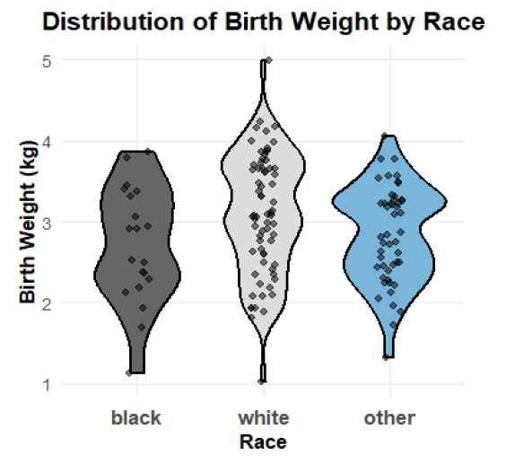

# GLM Analysis of Low Birth Weight

This project presents our statistical analysis of factors influencing low birth weight among newborns, conducted as part of an applied biostatistics exercise.  
We used **Generalized Linear Models (GLM)** with a **logistic regression** approach to study how demographic, behavioral, and medical characteristics of mothers affect the likelihood of low birth weight.

---

### **Project Overview**
We began with an exploratory analysis of the dataset, examining relationships between variables such as maternal age, race, smoking status, and socioeconomic background.

  

Following this stage, we fitted several logistic regression models to identify the most significant predictors of low birth weight and compared them based on fit statistics and interpretability.

Our findings indicated that **race**, **smoking status during pregnancy**, and **maternal age** were among the strongest predictors.  
We also performed residual analysis and model diagnostics to evaluate the model’s validity and detect potential outliers or influential points.

---

### **Results Visualization**

  

---

### **Files**
- `GLM-Low-Birth-Weight-Analysis.Rmd` – full reproducible analysis in R  
- `GLM-Low-Birth-Weight-Analysis.pdf` – complete written report including explanations, tables, and visualizations  

---

### **Authors**
Created by **Eden Malka** and **Itay Ben Avraham** – 2025  
© 2025 Eden Malka & Itay Ben Avraham. All rights reserved.
